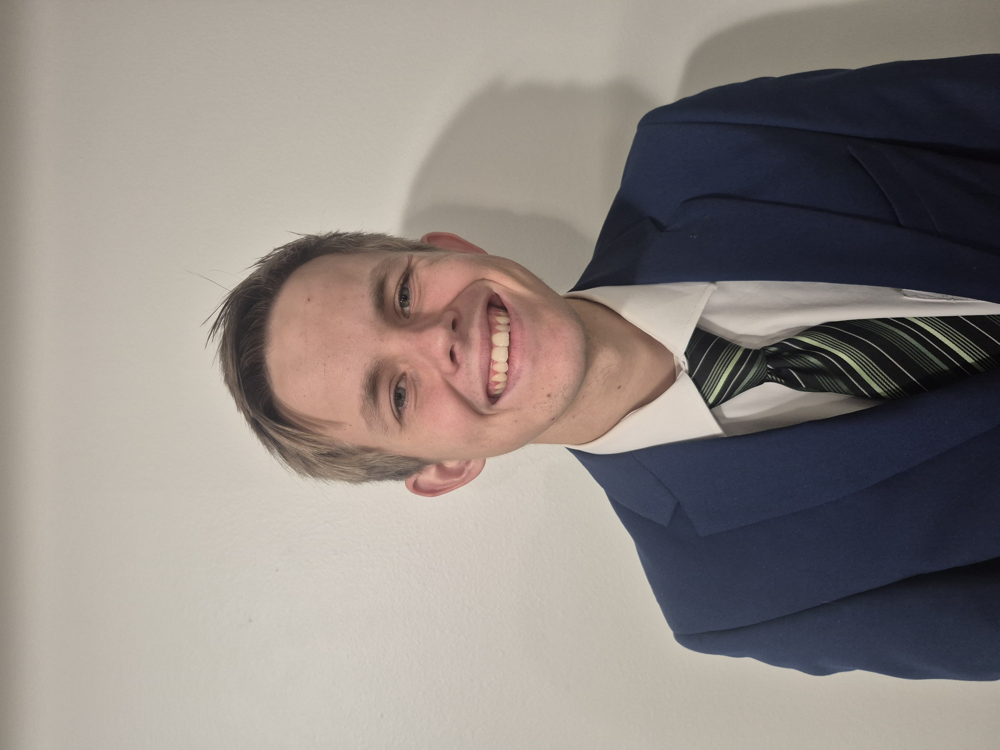

## Education & Background

  <h1 style="margin: 0; font-size: 16px; font-weight: normal;">
- I am a senior at BYU majoring Data Science. I plan to graduate in 2027.
- I love working with data to find correlations and patterns in order to make predictions and informed decisions.
- I currently work for the BYU Statistics department as a grader and tutor for various data science courses, and as a research assistant for a professor in the department. In this role I help with the Learning Outcomes Assessment for the department, which involves collecting and analyzing data on student learning outcomes to help improve the curriculum and teaching methods.
  </h1>
  

## Education

- **[BS Data Science]** - [BYU], [2027]
- **[AS Mathmatics and Science]** - [Santiago Canyon College], [2024]
- **Relevant Coursework**: Statistics(Both Frequentist and Bayesian), Data Analysis, Programming, Machine Learning, Data Visualization

## Skills & Interests

### Technical Skills

- **Programming**: Python, R, C++, SQL
- **Data Analysis**: Pandas, NumPy
- **Visualization**: Matplotlib, Seaborn
- **Machine Learning**: Scikit-learn
- **Tools**: Jupyter Notebooks, Git/GitHub, Rshiny

### Areas of Interest
- I enjoy working with data in various domains, including:
  - Sports analytics(specifically Soccer)
  - Gaming(both online and physical games)
  - Education

## Contact

- **Email**: corbinpchristiansen@gmail.com
- **GitHub**: [github.com/FBIagent42)](https://github.com/FBIagent42)
- **LinkedIn**: [linkedin.com/in/corbin-christiansen](www.linkedin.com/in/corbin-christiansen)

---

*This portfolio showcases my learning progress and projects completed during my data science studies.*
